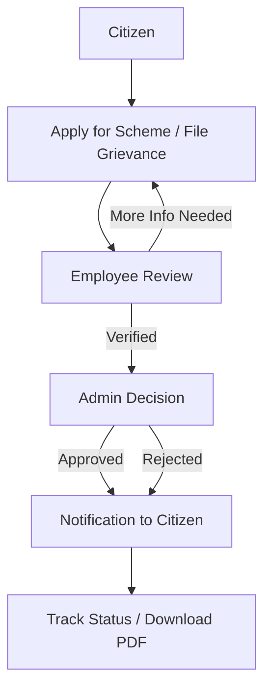

<div align="center"></div>

<h1 align="center">SaralSeva</h1>

<br>

 

<div align="center" style="margin: 10px 0 24px;">
  <a href="https://github.com/eccentriccoder01/SaralSeva/issues">� Report Bug</a>
  •
  <a href="https://github.com/eccentriccoder01/SaralSeva/issues">💡 Request Feature</a>
  
</div>

 
 
<h3>�📖 Table of Contents</h3>

- <a href="#overview"> Overview </a>
- <a href="#project-insights"> Project Insights </a>
- <a href="#vision"> 🇮🇳 The Vision: Digitising Governance at the Gram Panchayat Level </a>
- <a href="#why-saralseva"> Why SaralSeva? </a>
- <a href="#mission"> Mission </a>
- <a href="#demo"> Live Demo </a>
- <a href="#screenshots"> Screenshots </a>
- <a href="#key-features">Key Features</a>
- <a href="#technologies-used"> Technologies Used </a>
- <a href="#automated-dependency-management"> 🤖 Automated Dependency Management </a>
- <a href="#installation-setup"> Installation and Setup </a>
- <a href="#troubleshooting"> Troubleshooting </a>
- <a href="#acknowledgments">Acknowledgments</a>
- <a href="#contact">Contact</a>
- <a href="#how-to-contribute">How to Contribute</a>
- <a href="#contributing">Contributing</a>
- <a href="#code-of-conduct">Code of Conduct</a>
- <a href="#contribution-guidelines">Contribution Guidelines</a>
- <a href="#suggestions-feedback"> Suggestions & Feedback</a>
- <a href="#show-your-support">Show Your Support</a>
- <a href="#license">License</a>
- <a href="#stargazers">Stargazers</a>
- <a href="#forkers">Forkers</a>
- <a href="#project-admin">Project Admin</a>

 

<h2 id="overview">🔍 Overview</h2>

> **SaralSeva** is a web-based full stack application designed to streamline the application and grievance resolution process for rural government schemes. This platform offers user-friendly features for users to apply for schemes, track their progress, and receive updates, as well as powerful tools for administrators and employees to manage scheme applications, monitor performance, and communicate effectively.

 

<div align="center">
  
</div>

 

<h2 id="project-insights">📊 Project Insights</h2>

<table align="center">
    <thead align="center">
        <tr>
            <td><b>🌟 Stars</b></td>
            <td><b>🍴 Forks</b></td>
            <td><b>🐛 Issues</b></td>
            <td><b>🔔 Open PRs</b></td>
            <td><b>🔕 Closed PRs</b></td>
            <td><b>🛠️ Languages</b></td>
            <td><b>👥 Contributors</b></td>
        </tr>
     </thead>
    <tbody>
         <tr>
            <td></td>
            <td></td>
            <td></td>
            <td></td>
            <td></td>
            <td></td>
            <td></td>
        </tr>
    </tbody>
</table>
 

<h2 id="vision"> 🇮🇳 The Vision: Digitising Governance at the Gram Panchayat Level </h2>

SaralSeva strengthens grassroots governance to build a more inclusive and transparent Digital India:

- 🌐 24/7 digital access to services — fewer in-person visits
- 🔎 End‑to‑end tracking with unique IDs for trust and accountability
- ⚙️ Automated workflows to reduce delays and speed up delivery
- 📚 Centralised scheme information that empowers citizens
- 👥 Clear roles for staff and structured grievance redressal

  

<h2 id="why-saralseva">🤔 Why SaralSeva?</h2>

SaralSeva is built to make governance accessible, transparent, and efficient for everyone:

- 🧭 One-stop platform: apply for schemes, file grievances, and track updates in one place
- 🔍 Full transparency: real-time status, clear next steps, and notifications at each stage
- ⚙️ Streamlined processing: automated workflows reduce manual delays and errors
- 🛡️ Secure by design: role-based access, auditable actions, and safe data handling
- 📱 Citizen-first experience: simple forms, PDF receipts, and multilingual-ready UI

 

<h2 id="mission">🎯 Mission</h2>

Our mission is to make essential public services simple, transparent, and accessible for every citizen:

- 🚪 Accessibility first: 24/7 digital access to schemes and grievance services
- 🔎 Transparency by design: end-to-end tracking and clear status at each stage
- ⚙️ Efficiency at scale: automated, auditable workflows that reduce delays
- 🤝 Citizen empowerment: clear guidance, easy applications, and timely updates
- 🛡️ Reliability: secure data handling and role-based access for admins/employees

<h2 id="demo">🚀 Live Demo</h2>

Experience SaralSeva live here:
👉 [](https://saralseva.vercel.app/)

 

[](https://github.com/ellerbrock/open-source-badges/)


 

<h2 id="screenshots"> 📸 Screenshots </h2>

<div align="center"></div>

 

<h2 id="key-features">🌟 Key Features</h2>

SaralSeva is built on a robust three-tier architecture, providing distinct, secure, and feature-rich portals for each user role.

### 👤 **Citizen Portal**

- 🔐 **User Registration & Authentication**: Secure registration and login system with JWT and OTP verification via Twilio.
- 📝 **Scheme & Grievance Applications**: Users can easily apply for government schemes and submit grievances through intuitive forms.
- ⏱️ **Real-time Status Tracking**: Users can track the progress of their applications and grievances with a unique ID.
- 📊 **Personalised Dashboard**: A central place for users to view their application history and manage their profile.
- 📄 **PDF Downloads**: Users can download their applications as PDFs via `jsPDF` for their records.

### 🧑‍💼 **Employee Portal**

- 📋 **Task-Oriented Dashboard**: A clear view of all assigned scheme applications (tickets) and grievances.
- 🛠️ **Application Processing**: Tools to review applications, verify documents, and update statuses.
- 📈 **Performance Insights**: Admins can track and visualise employee performance data.
- 🔒💬 **Secure Messaging**: Internal chat system for communication with the admin.

### 🛡️ **Admin Portal**

- 📊 **Comprehensive Dashboard**: A high-level overview of all platform activity, including application statistics and employee performance.
- 🗂️ **Scheme Management**: Full control to add, update, and manage all available government schemes.
- 🤖 **Automated Ticket Assignment**: Fair distribution of applications among employees.
- ✅ **Final Approval Authority**: Power to give the final approval or rejection for all applications.
- 📢 **Broadcast Announcements**: Create and display important updates for all citizens.

 

<div align="center">
  


</div>
🌟 **Exciting News...**

🚀 This project is now an official part of GirlScript Summer of Code – GSSoC'25! 💃🎉💻 We're thrilled to welcome contributors from all over India and beyond to collaborate, build, and grow _SaralSeva!_ Let’s make learning and career development smarter – together! 🌟👨‍💻👩‍💻

👩‍💻 GSSoC is one of India’s **largest 3-month-long open-source programs** that encourages developers of all levels to contribute to real-world projects 🌍 while learning, collaborating, and growing together. 🌱

🌈 With **mentorship, community support**, and **collaborative coding**, it's the perfect platform for developers to:

- ✨ Improve their skills
- 🤝 Contribute to impactful projects
- 🏆 Get recognized for their work
- 📜 Receive certificates and swag!

🎉 **I can’t wait to welcome new contributors** from GSSoC 2025 to this SaralSeva project family! Let's build, learn, and grow together — one commit at a time. 🔥👨‍💻👩‍💻

 

<h2 id="technologies-used"> 🛠️ Technologies Used</h2>

### Frontend


### Backend


### DevOps & Automation


 

<h2 id="automated-dependency-management">🤖 Automated Dependency Management</h2>

SaralSeva uses **GitHub Dependabot** for automated dependency updates and security vulnerability management:

- 🔒 **Automatic security updates** - Immediate PRs for vulnerabilities
- 📅 **Weekly dependency updates** - Scheduled maintenance every Monday
- 🎯 **Smart grouping** - Related updates bundled together to reduce PR noise
- 🏷️ **Auto-labeling** - Organized by module and update type
- ⚡ **Zero maintenance** - Works automatically in the background

[📖 Learn more about our Dependabot setup](./DEPENDABOT.md)

  

<h2 id="flowchart">🧭 Project Flowchart</h2>

<div align="center">



</div>

<h2 id="installation-setup"> ⚙️ Installation and Setup </h2>
<h2 id="prerequisites">📋 Prerequisites</h2>

Ensure you have the following installed/configured:

- 🟢 Node.js 18+ and npm
- 🍃 MongoDB (local or Atlas)
- 🔐 Environment variables for JWT, MongoDB URL
- 📧 Optional: Twilio (OTP), Cloudinary (media), Google OAuth Client ID


> The project is a monorepo containing four separate applications: `backend`, `user`, `employee`, and `admin`. Each must be set up and run independently.

### Prerequisites

Ensure you have the following installed:

- **Node.js** and **npm**
- **MongoDB** (local or a cloud instance like MongoDB Atlas)

### 1. Clone the repository:

```bash
git clone https://github.com/eccentriccoder01/SaralSeva.git
cd SaralSeva
```

### 2\. Set up the Backend (`/backend`):

a. Navigate to the backend directory:

```bash
cd backend
```

b. Create a `.env` file and add the following environment variables with your credentials:

```env
PORT=8000

MONGODB_URL=YOUR_MONGODB_CONNECTION_STRING
JWT_SECRET=YOUR_JWT_SECRET_KEY
```

Twilio Credentials (I haven't provided my Twilio credentials in the deployment, since it is paid, LOL)

```bash
TWILIO_ACCOUNT_SID=YOUR_TWILIO_SID
TWILIO_AUTH_TOKEN=YOUR_TWILIO_AUTH_TOKEN
TWILIO_PHONE_NUMBER=YOUR_TWILIO_PHONE_NUMBER
```

Cloudinary Credentials

```bash
CLOUDINARY_NAME=YOUR_CLOUDINARY_CLOUD_NAME
CLOUDINARY_API_KEY=YOUR_CLOUDINARY_API_KEY
CLOUDINARY_SECRET_KEY=YOUR_CLOUDINARY_API_SECRET
```

Firebase Credentials

```bash
FIREBASE_API_KEY=YOUR_FIREBASE_API_KEY
FIREBASE_AUTH_DOMAIN=YOUR_FIREBASE_AUTH_DOMAIN
FIREBASE_PROJECT_ID=YOUR_FIREBASE_PROJECT_ID
FIREBASE_STORAGE_BUCKET=YOUR_FIREBASE_STORAGE_BUCKET
FIREBASE_MESSAGING_SENDER_ID=YOUR_FIREBASE_MESSAGING_SENDER_ID
FIREBASE_APP_ID=YOUR_FIREBASE_APP_ID
FIREBASE_MEASUREMENT_ID=YOUR_FIREBASE_MEASUREMENT_ID
```

Google Cloud Console (Google OAuth Client ID)

1. Application type: Web Application
2. Authorized JavaScript origins:
   - http://localhost:5173 (local development)
   - Any other frontend URI you use
3. Redirect URIs: Not needed for this setup

```bash
GOOGLE_CLIENT_ID=YOUR_GOOGLE_OAuth_CLIENT_ID
```

c. Install dependencies and run the server:

```bash
npm install
npm start
```

### 3\. Set up the Frontends (`/user`, `/employee`, `/admin`):

> **Note:** The following `.env` configuration is **only for the `/user`**:

```bash
VITE_API_BASE_URL=http://localhost:8000   # URL of your backend
VITE_GOOGLE_CLIENT_ID=YOUR_GOOGLE_OAuth_CLIENT_ID  # Must match backend
```

> Repeat the following steps for each frontend directory (`user`, `employee`, and `admin`) in a **separate terminal**.

a. Navigate to a frontend directory:

```bash
# In a new terminal
cd user
```

b. Install dependencies and run the development server:

```bash
npm install
npm run dev
```
  

<h2 id="troubleshooting">🛠️ Troubleshooting</h2>

- ⛔ Node version errors: check `node -v` (need v18+)
- 🔐 Missing/incorrect .env: ensure `MONGODB_URL`, `JWT_SECRET`, optional third-party keys
- 🗄️ MongoDB connection failed: allow IP in Atlas; verify user roles and connection string
- 🔌 Port in use: change ports or kill process using `netstat -ano | findstr :8000`
- 🌐 CORS errors: verify frontend origin is allowed in server CORS config

 

## Issue Creation ✴

Report bugs and issues or propose improvements through our GitHub repository's "Issues" tab.

## Contribution Guidelines 📑

- Firstly Star(⭐) the Repository
- Fork the Repository and create a new branch for any updates/changes/issue you are working on.
- Start Coding and do changes.
- Commit your changes
- Create a Pull Request which will be reviewed and suggestions would be added to improve it.
- Add Screenshots and updated website links to help us understand what changes is all about.

- Check the [CONTRIBUTING.md](CONTRIBUTING.md) for detailed steps...

 
 
## Contributing is fun🧡

We welcome all contributions and suggestions!
Whether it's a new feature, design improvement, or a bug fix - your voice matters 💜

Your insights are invaluable to us. Reach out to us team for any inquiries, feedback, or concerns.

  

<h2 id="acknowledgments">🙏 Acknowledgments</h2>

- Thanks to all contributors of this project
- Special shoutout to **GirlScript Summer of Code (GSSoC’25)** for the amazing community and support!
- Built with dedication, collaboration, and lots of chai

  

<h2 id="contact">📞 Contact</h2>

- **Developed by [Eccentric Explorer](https://eccentriccoder01.github.io/Me)**
- **GitHub Issues**: [Report bugs or request features](https://github.com/eccentriccoder01/SaralSeva/issues)
- **Email**: Contact the maintainers for collaboration opportunities

_Feel free to reach out with any questions or feedback!_

  

<h2 id="how-to-contribute">🤝How to Contribute</h2>

We love contributions from the community! Whether it's a bug report, a new feature, or a documentation improvement, we appreciate your help.

**_How to Contribute_**

1.  **Fork the repository** and create a new branch for your changes.
2.  **Make your changes** and ensure everything is working as expected.
3.  **Submit a pull request** with a clear description of your changes.

**_Found a Bug?_**

- Check the [issue tracker](https://github.com/eccentriccoder01/SaralSeva/issues) to see if the bug has already been reported.
- If not, open a new issue and provide as much detail as possible.

**_Have a Feature Idea?_**

- We'd love to hear it! Open an issue to discuss your idea.

  

<h2 id="contributing">🤝 Contributing</h2>

We welcome contributions from developers of all skill levels! Here are some ways you can contribute:

### Ways to Contribute

- 🐛 Bug fixes - Help us identify and fix bugs
- ✨ New features - Suggest and implement new functionality
- 📚 Documentation - Improve our docs and guides
- 🎨 UI/UX improvements - Make the platform more user-friendly
- 🔧 Performance optimizations - Help make SaralSeva faster and more efficient
- 🌐 Translations - Help make SaralSeva accessible in more languages
- 📱 Mobile responsiveness - Improve the mobile experience
- 🔒 Security enhancements - Help keep user data safe

_Thank you to everyone who has made SaralSeva better! 💚_

  

<h2 id="code-of-conduct">📜 Code of Conduct</h2>

Please refer to the [`Code of Conduct`](https://github.com/eccentriccoder01/SaralSeva/blob/main/CODE_OF_CONDUCT.md) for details on contributing guidelines and community standards.

  

<h2 id="contribution-guidelines">🤝👤 Contribution Guidelines</h2>

We love our contributors! If you'd like to help, please check out our [`CONTRIBUTE.md`](https://github.com/eccentriccoder01/SaralSeva/blob/main/CONTRIBUTING.md) file for guidelines.

> Thank you once again to all our contributors who has contributed to **SaralSeva!** Your efforts are truly appreciated. 💖👏

<!-- Contributors badge (auto-updating) -->

[](https://github.com/RhythmPahwa14/eccentriccoder01/SaralSeva/contributors)

<!-- Contributors avatars (auto-updating) -->
<p align="left">
  <a href="https://github.com/eccentriccoder01/SaralSeva/graphs/contributors">
    
  </a>
</p>

See the full list of contributors and their contributions on the [`GitHub Contributors Graph`](https://github.com/eccentriccoder01/SaralSeva/graphs/contributors).

 

<h2 align="center">
<p style="font-family:var(--ff-philosopher);font-size:3rem;"><b> Show some  by starring this awesome repository!
</p>
</h2>

  

<h2 id="suggestions-feedback">💡 Suggestions & Feedback</h2>

Feel free to open issues or discussions if you have any feedback, feature suggestions, or want to collaborate!

  

<h2 id="show-your-support">🙌 Show Your Support</h2>

_If you find SaralSeva project helpful, give it a star! ⭐ to support more such educational initiatives:_

- ⭐ **Starring the repository**
- 🐦 **Sharing on social media**
- 💬 **Telling your friends and colleagues**
- 🤝 **Contributing to the project**

  

<h2 id="license">📄 License</h2>

This project is licensed under the MIT License - see the [`License`](https://github.com/eccentriccoder01/SaralSeva/blob/main/LICENSE) file for details.

  

<h2 id="stargazers">⭐ Stargazers</h2>

<div align="center">
  <a href="https://github.com/eccentriccoder01/SaralSeva/stargazers">
    
  </a>
</div>

 

<h2 id="forkers">🍴 Forkers</h2>

<div align="center">
  <a href="https://github.com/eccentriccoder01/SaralSeva/members">
    
  </a>
</div>

 

<h2 id="project-admin" align="center">🧑‍💻Project Admin:</h2>
<table>
<tr>
<td align="center">
<a href="https://github.com/eccentriccoder01"></a><br><sub><b>Sagnik Chakraborty</b><br><a href="https://www.linkedin.com/in/eccentricexplorer"></a>
</sub>
</td>
</tr>
</table>

 

<h1 align="center"> Give us a Star and let's make magic! </h1>

<p align="center">
     
</p>

 

<h3 align="center"> 👨‍💻 Built with ❤️ by SaralSeva Team</h3>
<h4 align="center"> ❤️ Sagnik Chakraborty and Contributors ❤️ </h4>
<p align="center">
  <a href="https://github.com/eccentriccoder01/SaralSeva/issues">Open an Issue</a> | <a href="https://github.com/eccentriccoder01/SaralSeva">🌟 Star on GitHub</a> | <a href="https://saralseva.vercel.app/">🚀 Live Demo</a></p>


<p align="center">
  <a href="#top" style="font-size: 18px; padding: 8px 16px; display: inline-block; border: 1px solid #ccc; border-radius: 6px; text-decoration: none;">
    ⬆️ Back to Top
  </a>
</p>
 

> Ready to show off your coding achievements? Get started with **SaralSeva** today! 🚀

 
